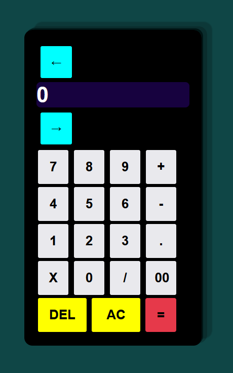
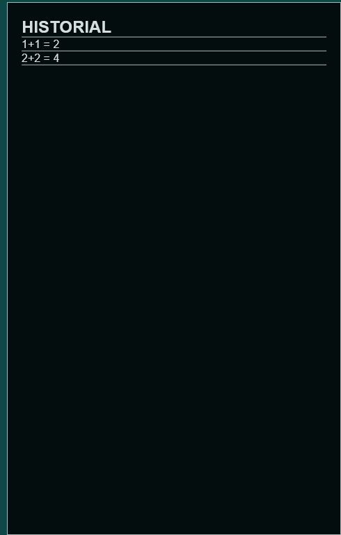

# Spanish
# Calculadora 
Este es un programa de calculadora simple que puedes utilizar en tu navegador web. Puedes realizar operaciones matemáticas básicas como suma, resta, multiplicación y división. El programa tiene una interfaz intuitiva y una pantalla de visualización donde se muestran los números y resultados.
## Características 
1. Botones numéricos del 0 al 9.
2. Botones de operadores: suma **(+)**, resta **(-)**, multiplicación **(X)** y división **(/)**.
3. Botón de punto decimal **(.)** para números decimales.
4. Botón de **"AC"** para borrar y reiniciar la pantalla.
5. Botón de **"DEL"** para eliminar el último dígito ingresado.
6. Botón de igual **(=)** para mostrar el resultado de la operación.
7. Botones de navegación izquierda **(←)** y derecha **(→)** para desplazarse por la pantalla.

## uso 

1. Abre el archivo index.html en tu navegador web.
2. Verás la calculadora en la pantalla con los botones y la pantalla de visualización.
3. Haz clic en los botones numéricos y operadores para ingresar una expresión matemática.
4. Los números y operadores se mostrarán en la pantalla de visualización.
5. Puedes utilizar los botones de navegación izquierda **(←)** y derecha **(→)** para  desplazarte por la pantalla y ver el contenido completo.
6. Para obtener el resultado de la operación, haz clic en el botón de igual **(=)**.
7. El resultado se mostrará en la pantalla de visualización.
8. Personalización.
9. Si deseas personalizar el aspecto de la calculadora, puedes modificar el archivo style.css. Aquí encontrarás las clases y estilos utilizados para dar formato a los elementos de la calculadora. Puedes ajustar los colores, tamaños y disposición de acuerdo a tus preferencias.
9. Ahora se cuenta podra visualizar y comprobar el resultado ya obtenido en la calculadora mediante el historial.

## Tecnologías utilizadas
- **HTML**
- **CSS**
- **JavaScript**
## Archivos

- `index.html`: Archivo principal que contiene la estructura HTML de la calculadora.
- `style.css`: Archivo de hojas de estilo CSS que define el aspecto visual de la calculadora.
- `script.js`: Archivo de JavaScript que maneja la lógica y funcionalidad de la calculadora.

## Creditos

Este programa de calculadora fue creado por **Samuel Moscoso**.  

## Licencia

Este proyecto está acargo de **Samuel Moscoso**
#
# English
# Calculator
This is a simple calculator program that you can use in your web browser. You can perform basic mathematical operations such as addition, subtraction, multiplication, and division. The program has an intuitive interface and a display screen where numbers and results are shown.

## Features
1. Numeric buttons from 0 to 9.
2. Operator buttons: addition **(+)**, subtraction **(-)**, multiplication **(X)**, and division **(/)**.
3. Decimal point button **(.)** for decimal numbers.
4. **"AC"** button to clear and reset the screen.
5. **"DEL"** button to delete the last entered digit.
6. Equal button **(=)** to display the result of the operation.
7. Left **(←)** and right **(→)** navigation buttons to scroll through the screen.

## Usage
1. Open the index.html file in your web browser.
2. You will see the calculator on the screen with the buttons and the display screen.
3. Click on the numeric buttons and operators to enter a mathematical expression.
4. The numbers and operators will be displayed on the display screen.
5. You can use the left **(←)** and right **(→)** navigation buttons to scroll through the screen and view the entire content.
6. To obtain the result of the operation, click on the equal button **(=)**.
7. The result will be displayed on the display screen.

## Customization
If you want to customize the appearance of the calculator, you can modify the style.css file. Here you will find the classes and styles used to format the calculator elements. You can adjust the colors, sizes, and layout according to your preferences.

## Technologies Used
- **HTML**
- **CSS**
- **JavaScript**
## Files

- `index.html`: Main file that contains the HTML structure of the calculator.
- `style.css`: CSS file that defines the visual appearance of the calculator.
- `script.js`: JavaScript file that handles the logic and functionality of the calculator.

## Credits
This calculator program was created by **Samuel Moscoso**

# Versions

## V1.0

## V1.1
